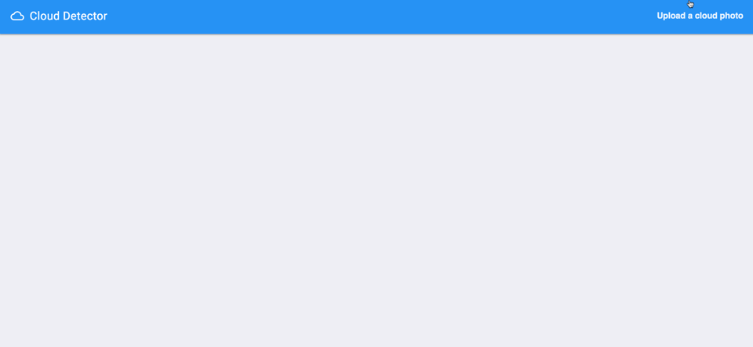

# Demo: querying a custom AutoML model from a web app

This demo shows how to call a custom AutoML model from a web app using the [AutoML API](https://cloud.google.com/vision/automl/docs/reference/rest/). It queries an AutoML Vision model, but the code can easily be adapted for AutoML Natural Language since the API is the same for both. The model I'm using for this predicts the type of cloud in an image:



*For more details on this specific vision model, check out the AutoML section of my [Cloud Next '18 talk](https://youtu.be/QU7_eU8HzAQ?t=16m12s).*

## Pre-requisites

* You've built and trained a model with [Cloud AutoML](http://cloud.google.com/automl). 
* You've enabled the AutoML API in your Cloud project
* You've created a project in the Firebase console and associated it with the same project where you trained your AutoML model. Using the [Firebase CLI](https://firebase.google.com/docs/cli/), make sure to initialize your project with Functions, Firestore, and Hosting:


## Deploying the function

The `functions/index.js` file includes the functions code to call the custom AutoML model. 

First, replace the 3 placeholder strings at the top of the file with  info for your own project and AutoML model:

```javascript
const project = 'YOUR_PROJECT_NAME';
const region = 'YOUR_PROJECT_REGION';
const automl_model = 'YOUR_AUTOML_MODEL_ID';
```

Now you're ready to deploy the function. From the root directory of this project, run the command:

```bash
firebase deploy --only functions
```

Once your function deploys successfully you can test it by uploading a photo to the Firebase Storage bucket in your project. Then check your Firestore database. You should see the prediction data for that image:


## Deploying the frontend

The frontend code for this app is all in the `public/` directory and uses good old jQuery :) In `public/main.js`, a photo is uploaded to the Firebase Storage bucket for your project which triggers the function calling the AutoML API. First, try it out by serving the frontend locally. Run `firebase serve` from the root directory of this project, navigate to `localhost:5000`, and you should see this:


If the frontend is working correctly you're ready to deploy it. Run the command:

```bash
firebase deploy --only hosting
```

Now your app should be deployed to a firebaseapp.com domain, woohoo!